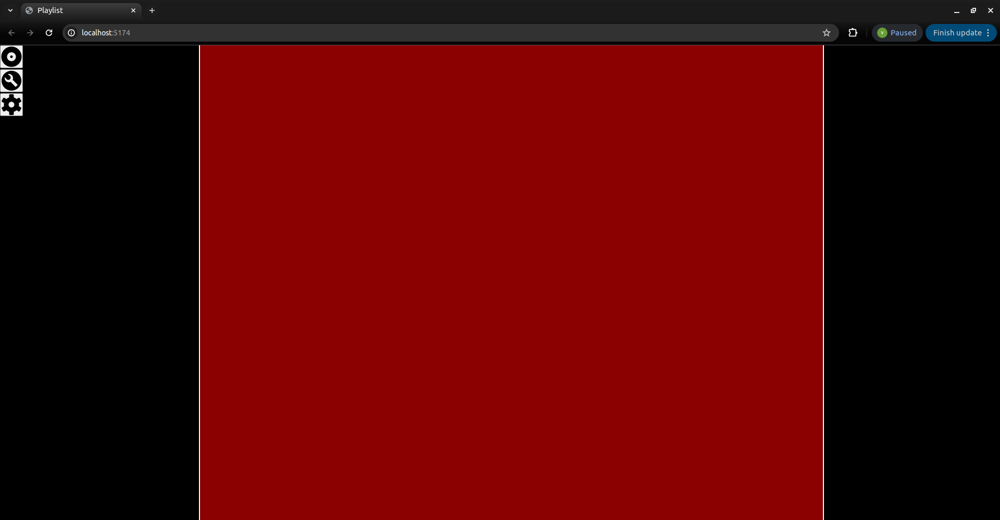
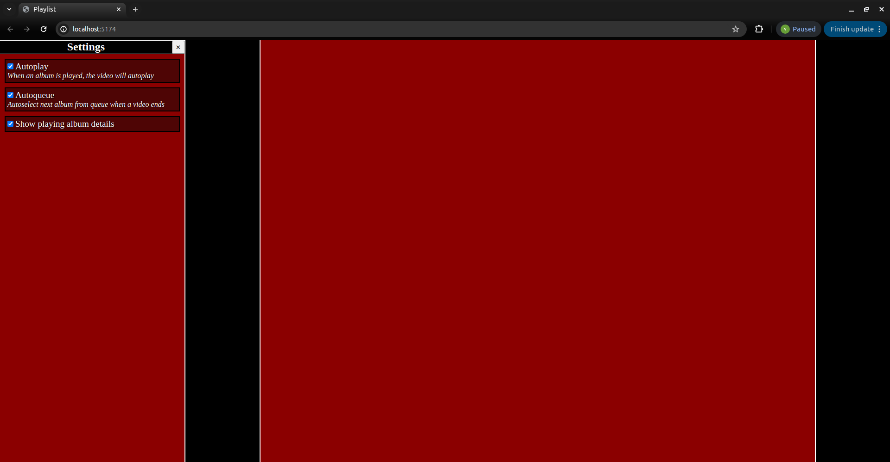
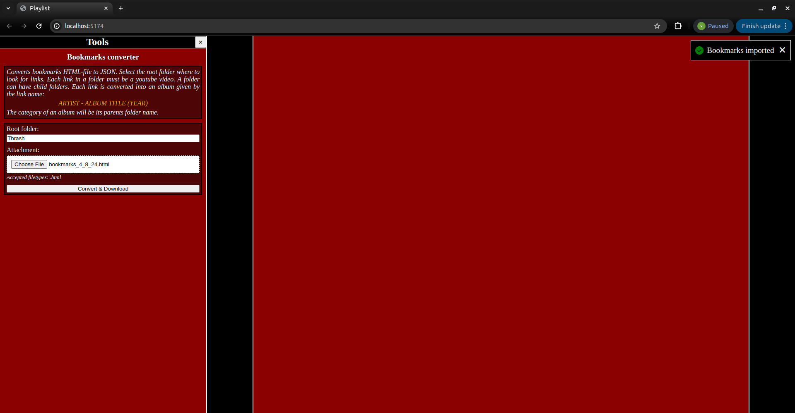
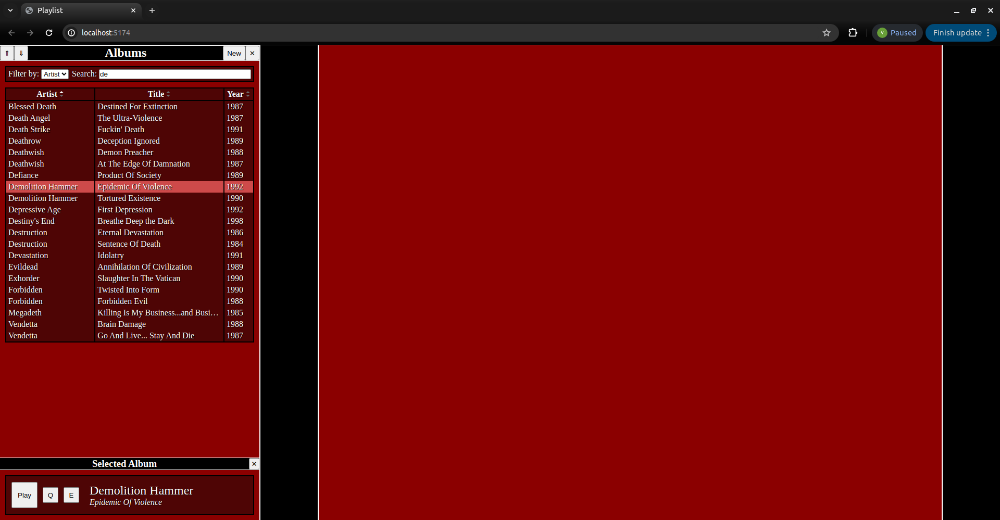
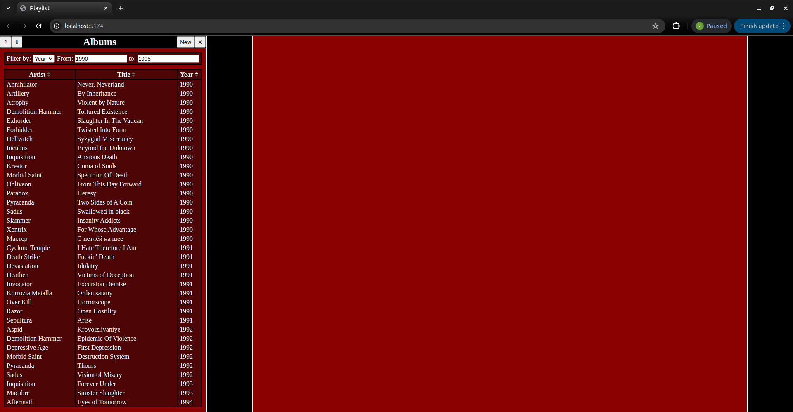
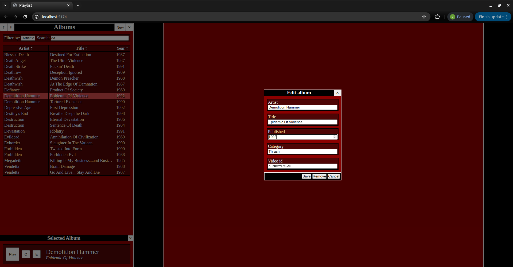
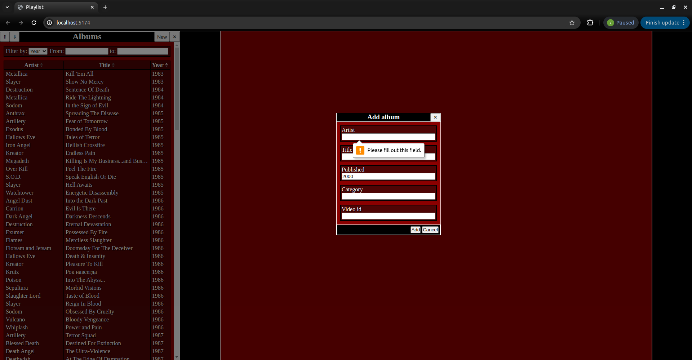
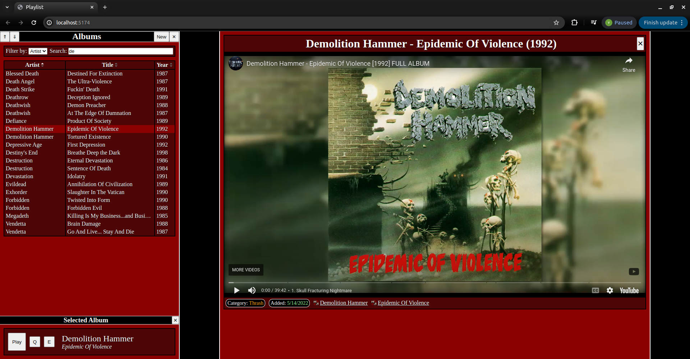
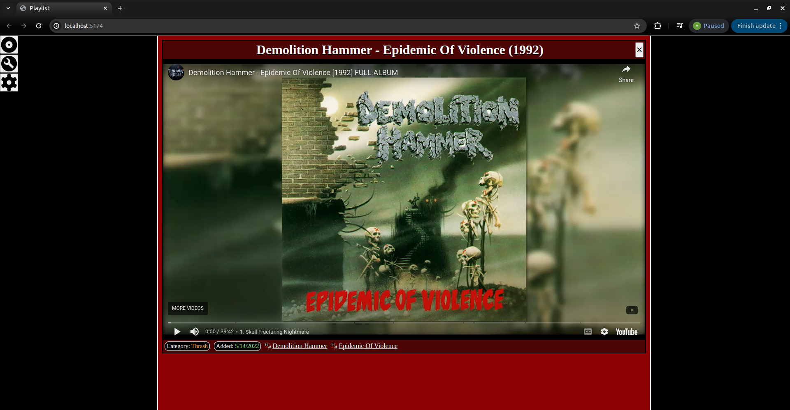
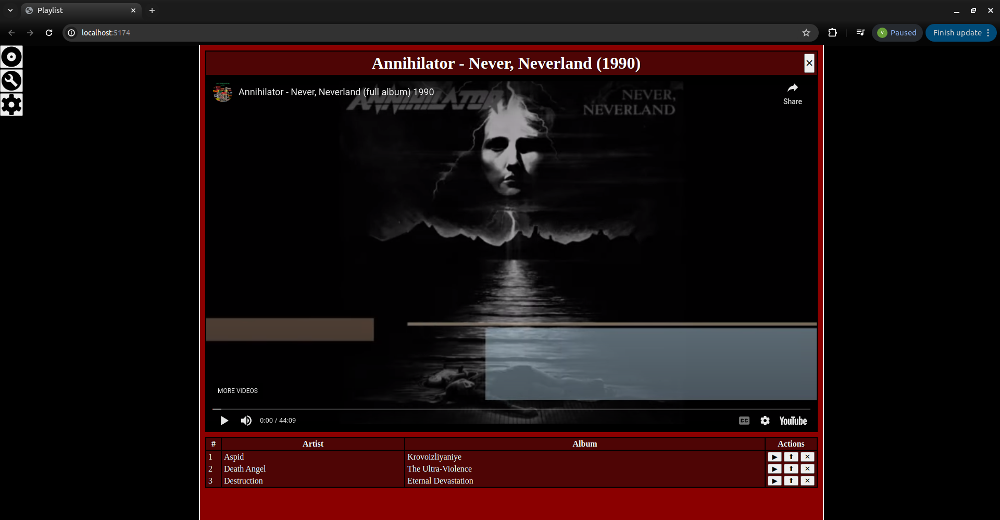

# Bookmark playlist
Import your bookmark html file and view it as a playlist

## Features
<ul>
  <li>Convert bookmarks into a playlist</li>
  <li>Sort and filter albums</li>
  <li>Play albums from the playlist, or add them in a queue</li>
  <li>Create/Update/Delete albums</li>
</ul>

## How to start
### Installing
You need to install server and client packages. Execute the command
```
npm install
```
inside the server AND client folder.

### Starting
After server and client packages are installed, run the following command in the root folder
#### Development
```
npm run compose:up
```
you can access the server in PORT 3000 and client in PORT 5173.
#### Test
```
npm run test:up
```
you can access the server in PORT 3001 and client in PORT 5174.

## Screenshots

*Initial view*


*Settings sidebar*


*Importing bookmarks in tools sidebar*


*Filtering and selecting an album in albums sidebar*


*Filtering and sorting albums*


*Editing an album*


*Creating a new album*


*Playing*


*Fullscreen*


*Queueing*
